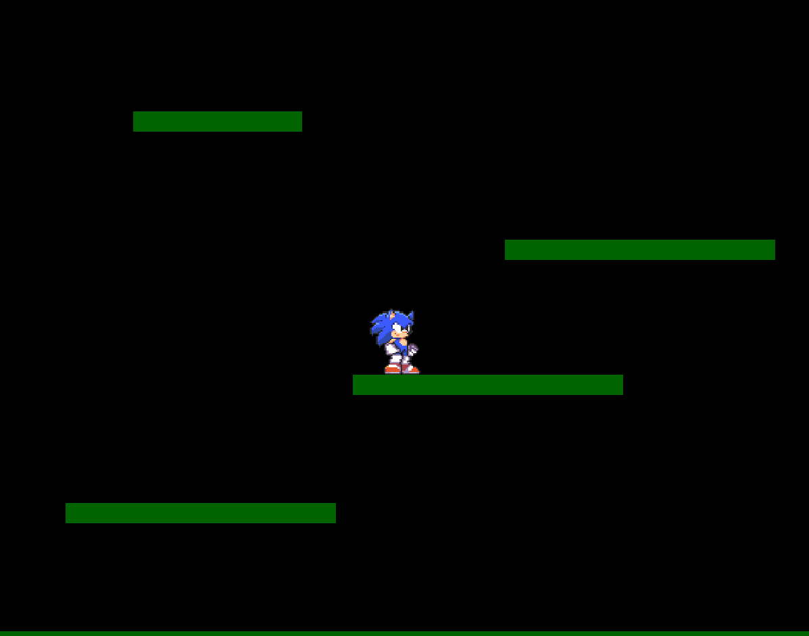

# Sonic platforms

This was going to be a game however I chose not to finish it.

Sonic can run around and jump on the platforms.

I implemented Coyote time, jump buffering and the jump action works well.

It is written using SDL2 and you will need to have the SDL2 development libraries installed to run this.

This would be useful for looking at as an example of how to get started in SDL2.



## Getting Started

The game comes with a makefile. Simply type make when in the directory and it will compile.

The controls are the arrow keys and spacebar to jump.

Here is how the code works.
player.h contains a structure which is the player. In the main function an instance of this structure is created named sonic.
player_engine.c contains all the functions that affect the sonic sprite. For example, running, jumping and moving. 

The game loop is in the main() function in the sonic.c file. A number of calls to SDL_GetTicks() are used for changing sprite animations, controlling movement when running and jumping and animating sonic when he is standing.

map.c contains a structure named map. 
An instance of this is created and named level. map.c contains the functions that have to do with the map. Namely drawing the platforms and collission detection.

I have aimed to leave ample notes throughout to explain the code in case anyone is interested or I chose to come back and work on it again.
  
## Prerequisites

If you don't have the SDL2 libraries installed then the below should work.

```
sudo apt-get install libsdl2-dev
```

## Author

* **hatchet-elf** 
* **https://github.com/hatchet-elf/Sonic-platforms** 


## License

This project is licensed under the MIT License - see the [LICENSE] file for details


